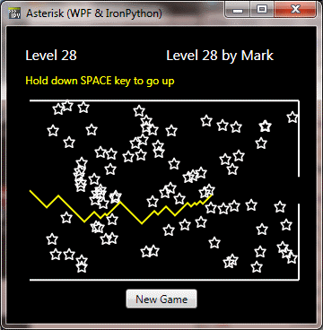
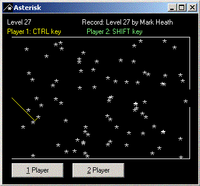

**Project Description**
.NET version of a very simple BBC Micro game in which you navigate through screens of asterisks without crashing. The source code includes four implementations:

* C# WinForms (original version)
* IronPython WPF
* IronPython Silverlight (using Gestalt)
* C# Silverlight 4

## WPF Version (IronPython)

## WinForms Version (C#)

